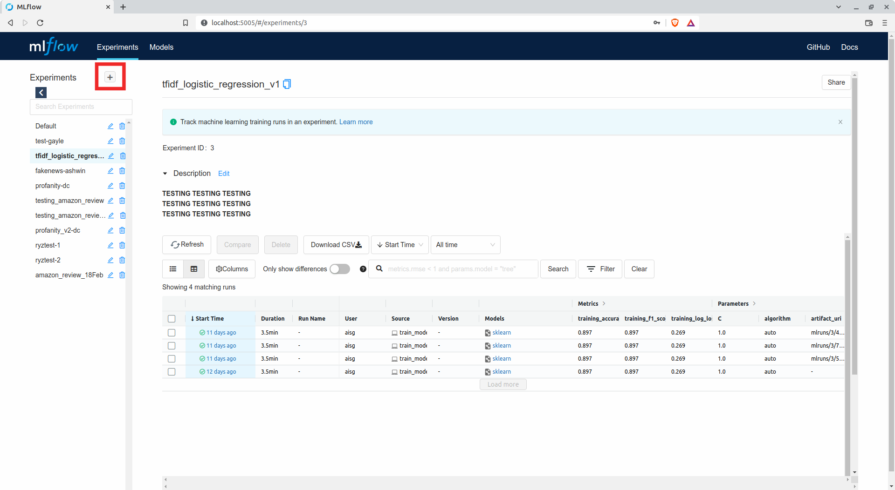
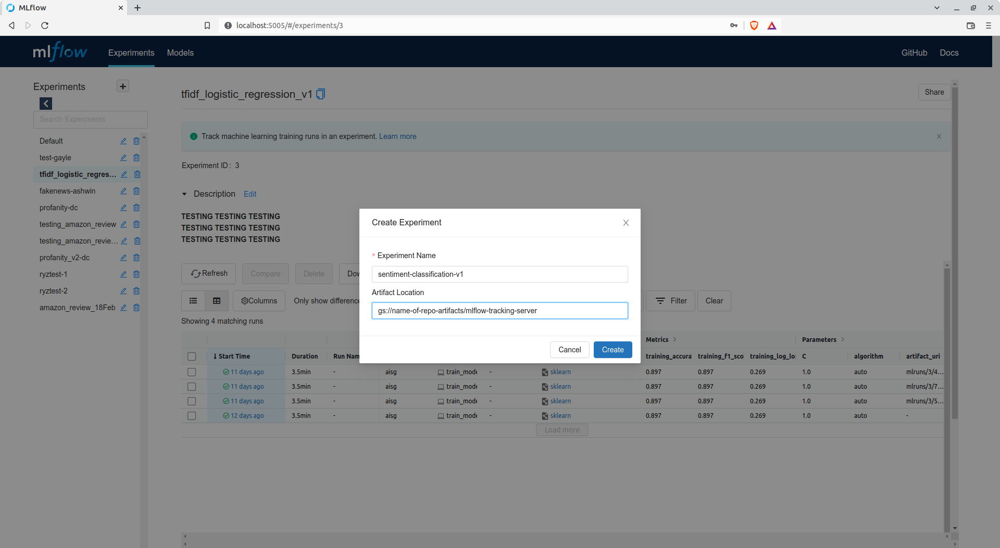

# Job Orchestration

Even though we can set up development workspaces to execute jobs and
workflows, these environments often have limited access to resources.
To carry out heavier workloads, we encourage the usage of job
orchestration features that the Polyaxon platform has.

Jobs are submitted to the Polyaxon server and executed within Docker
containers. These images are either pulled from a registry or built upon
a job's submission. The names and definitions of images are specified in
Polyaxonfiles. Using these images, Kubernetes pods are spun up to
execute the entry points or commands defined, tapping on to the
Kubernetes cluster's available resources.

Any jobs that are submitted to the Polyaxon server can be tracked and
monitored through Polyaxon's dashboard. See
[this section](./03-mlops-components-platform.md#polyaxon-dashboard)
on how to access the dashboard for Polyaxon and create a project.

## Pipeline Configuration

In this template, Hydra is the configuration framework of choice for the
data preparation and model training pipelines (or any
pipelines that doesn't belong to the model serving aspects).

The configurations for logging, pipelines and hyperparameter tuning
can be found under `conf/base`. These YAML files are then referred to
by Hydra or general utility functions
(`src/cookie_mask_rcnn/general_utils.py`)
for loading of parameters
and configurations. The defined default values can be overridden through
the CLI.

!!! attention
    It is recommended that you have a basic understanding of
    [Hydra](https://hydra.cc/)'s
    concepts before you move on.

__Reference(s):__

- [Hydra Docs - Basic Override Syntax](https://hydra.cc/docs/advanced/override_grammar/basic/)

## Data Preparation & Preprocessing

To process the sample raw data,
we will be spinning up a job on Polyaxon.
This job will be using a Docker image that will be built from
a Dockerfile (`docker/cookie-mask-rcnn-data-prep.Dockerfile`)
provided in this template:

=== "Linux/macOS"

    ```bash
    $ export GCP_PROJECT_ID=cvhub-312105
    $ docker build \
        -t asia.gcr.io/$GCP_PROJECT_ID/teck/data-prep:0.1.0 \
        -f docker/cookie-mask-rcnn-data-prep.Dockerfile \
        --platform linux/amd64 .
    $ docker push asia.gcr.io/$GCP_PROJECT_ID/teck/data-prep:0.1.0
    ```

=== "Windows PowerShell"

    ```powershell
    $ $GCP_PROJECT_ID='cvhub-312105'
    $ docker build `
        -t asia.gcr.io/$GCP_PROJECT_ID/teck/data-prep:0.1.0 `
        -f docker/cookie-mask-rcnn-data-prep.Dockerfile `
        --platform linux/amd64 .
    $ docker push asia.gcr.io/$GCP_PROJECT_ID/teck/data-prep:0.1.0
    ```

Assuming you're still connected to the Polyaxon server through
port-forwarding, submit a job to the server like such:

=== "Linux/macOS"

    ```bash
    $ polyaxon run -f aisg-context/polyaxon/polyaxonfiles/process-data.yml \
        -P DOCKER_IMAGE="asia.gcr.io/$GCP_PROJECT_ID/teck/data-prep:0.1.0" \
        -P RAW_DATA_DIRS='["/polyaxon-v1-data/workspaces/<YOUR_NAME>/data/acl-movie-review-data-aisg/aclImdb-aisg-set1"]' \
        -P PROCESSED_DATA_DIR="/polyaxon-v1-data/workspaces/<YOUR_NAME>/data/processed/aclImdb-aisg-combined" \
        -P WORKING_DIR="/home/aisg/cookie-mask-rcnn" \
        -p cookie-mask-rcnn-<YOUR_NAME>
    ```

=== "Windows PowerShell"

    ```powershell
    $ polyaxon run -f aisg-context/polyaxon/polyaxonfiles/process-data.yml `
        -P DOCKER_IMAGE="asia.gcr.io/$GCP_PROJECT_ID/teck/data-prep:0.1.0" `
        -P RAW_DATA_DIRS="['/polyaxon-v1-data/workspaces/<YOUR_NAME>/data/acl-movie-review-data-aisg/aclImdb-aisg-set1']" `
        -P PROCESSED_DATA_DIR="/polyaxon-v1-data/workspaces/<YOUR_NAME>/data/processed/aclImdb-aisg-combined" `
        -P WORKING_DIR="/home/aisg/cookie-mask-rcnn" `
        -p cookie-mask-rcnn-<YOUR_NAME>
    ```

!!! info
    If you were to inspect
    `aisg-context/polyaxon/polyaxonfiles/process-data.yml`,
    the second command with `yq` overwrites the list of directories
    specified in the config file `conf/base/pipelines.yml` for the key
    `.data_prep.raw_dirs_paths`. You may specify a list of directory paths
    with which you can process and combine the results into one single
    directory. The `yq` utility is used to overwrite the values in the YAML
    config as
    [Hydra currently doesn't support modification of list in YAML files](https://github.com/facebookresearch/hydra/issues/1547)
    .

After some time, the data processing job should conclude and we can
proceed with training the predictive model.
The processed data is exported to the directory
`/polyaxon-v1-data/workspaces/<YOUR_NAME>/data/processed/aclImdb-aisg-combined`.
We will be passing this path to the model training workflows.

## Model Training

Now that we have processed the raw data, we can look into training the
sentiment classification model. The script relevant for this section
is `src/train_model.py`. In this script, you can see it using
some utility functions from
`src/cookie_mask_rcnn/general_utils.py`
as well, most notably the functions for utilising MLflow utilities
for tracking experiments. Let's set up the tooling for experiment
tracking before we start model experimentation.

### Experiment Tracking

In the module `src/cookie_mask_rcnn/general_utils.py`,
the functions `mlflow_init` and `mlflow_log` are used to initialise
MLflow experiments as well as log information and artifacts relevant
for a run to a remote MLflow Tracking server.
An MLflow Tracking server is usually set up within a GKE cluster for
projects that requires model experimentation.
Artifacts logged through the MLflow API can be
uploaded to GCS buckets, assuming the client is authorised for
access to GCS.

!!! note
    The username and password for the MLflow Tracking server
    can be retrieved from the MLOps team or your team lead.

To log and upload artifacts to GCS buckets through MLflow, you need to
do the following first:

1. Ensure that the Polyaxon job for model experimentation is configured
   to use your GCP project's service account credentials.
   See
   ["Secrets & Credentials on Kubernetes"](./03-mlops-components-platform.md#secrets-credentials-on-kubernetes)
   on how to do this.
2. Create a bucket for storing such artifacts on GCS.
3. Create an MLflow experiment on the tracking server.

Let's create a GCS bucket
for storing all your model experiment artifacts (assuming the bucket
has yet to be created):

!!! important
    For the purpose of this guide, we will create a bucket with the
    following name: `gs://cookie-mask-rcnn-artifacts`.
    The Docker images that we will be using to spin up inference
    servers will download exported model artifacts from this bucket,
    under a subdirectory `mlflow-tracking-server`. Hence, the longer
    path
    of the directory where all the model artifacts will be stored at
    will be
    `gs://cookie-mask-rcnn-artifacts/mlflow-tracking-server`.

=== "Local Machine / Polyaxon VSCode Terminal"

    ```bash
    $ gsutil mb -p cvhub-312105 -c STANDARD -l ASIA-SOUTHEAST1 -b on gs://cookie-mask-rcnn-artifacts
    Creating gs://cookie-mask-rcnn-artifacts/...
    ```

Now, let's access the MLflow Tracking server's dashboard
to create an experiment for us to log runs to. Open a
separate terminal and run the following:

=== "Local Machine"

    ```bash
    $ kubectl port-forward service/mlflow-nginx-server-svc 5005:5005 --namespace=polyaxon-v1
    ```

Head over to your web browser and access the following URL:
`http://localhost:5005`.
You would be prompted for a username and password and upon a
successful entry
you should be presented with an interface
similar to the one below:


We are to collate runs under experiments. See
[here](https://www.mlflow.org/docs/latest/tracking.html#organizing-runs-in-experiments)
for the distinction between runs and experiments. For each
experiment, we can specify paths and URLs for which we intend to upload
artifacts to.

To create an experiment, locate a `+` button on the top left hand
corner of the interface.



A pop-up box follows prompting a name for the experiment
and a location for artifacts to be stored at.

For the current use case, let's make use of the path we have specified
for MLflow artifacts, with your name appended:
`gs://cookie-mask-rcnn-artifacts/mlflow-tracking-server/teck`.
For name of experiment, you can specify a name like so:
`ml-experiment-teck`.

!!! warning
    Here are some things to take note when creating an experiment:

    - Specifying object storage paths for a new experiment
    through MLflow's CLI does not work well currently so we would have
    to make do with creation of experiments through the UI.
    - It is highly recommended that experiment names are
      __without whitespaces__. Words can be concatenated with hyphens.



__Reference(s):__

- [MLflow Docs - Tracking](https://www.mlflow.org/docs/latest/tracking.html#)
- [MLflow Docs - Tracking (Artifact Stores)](https://www.mlflow.org/docs/latest/tracking.html#artifact-stores)

### Container for Experiment Job

Before we submit a job to Polyaxon to train our model,
we need to build the Docker image to be used for it:

=== "Linux/macOS"

    ```bash
    $ docker build \
        -t asia.gcr.io/$GCP_PROJECT_ID/teck/model-train:0.1.0 \
        -f docker/cookie-mask-rcnn-model-training-gpu.Dockerfile \
        --platform linux/amd64 .
    $ docker push asia.gcr.io/$GCP_PROJECT_ID/teck/model-train:0.1.0
    ```

=== "Windows PowerShell"

    ```powershell
    $ docker build `
        -t asia.gcr.io/$GCP_PROJECT_ID/teck/model-train:0.1.0 `
        -f docker/cookie-mask-rcnn-model-training-gpu.Dockerfile `
        --platform linux/amd64 .
    $ docker push asia.gcr.io/$GCP_PROJECT_ID/teck/model-train:0.1.0
    ```

Now that we have the Docker image pushed to the registry,
we can run a job using it:

!!! attention

    If the GKE cluster is without GPU nodes, the __Polyaxonfiles would
    have to be edited__ to remove any request for GPUs (otherwise
    the job cannot be scheduled).

    __Delete the following lines:__
    ```yaml
    ...
        tolerations:
          - key: "nvidia.com/gpu"
            operator: "Equal"
            value: "present"
            effect: "NoSchedule"
    ...
            nvidia.com/gpu: 1
    ...
    ```


=== "Linux/macOS"

    ```bash
    $ export MLFLOW_TRACKING_USERNAME=<MLFLOW_TRACKING_USERNAME>
    $ export MLFLOW_TRACKING_PASSWORD=<MLFLOW_TRACKING_PASSWORD>
    $ export CLUSTER_IP_OF_MLFLOW_SERVICE=$(kubectl get service/mlflow-nginx-server-svc -o jsonpath='{.spec.clusterIP}' --namespace=polyaxon-v1)
    $ polyaxon run -f aisg-context/polyaxon/polyaxonfiles/train-model-gpu.yml \
        -P DOCKER_IMAGE="asia.gcr.io/$GCP_PROJECT_ID/teck/model-train:0.1.0" \
        -P MLFLOW_TRACKING_USERNAME=$MLFLOW_TRACKING_USERNAME -P MLFLOW_TRACKING_PASSWORD=$MLFLOW_TRACKING_PASSWORD \
        -P SETUP_MLFLOW=true -P MLFLOW_AUTOLOG=true \
        -P MLFLOW_TRACKING_URI="http://$CLUSTER_IP_OF_MLFLOW_SERVICE:5005" -P MLFLOW_EXP_NAME=<MLFLOW_EXPERIMENT_NAME> \
        -P WORKING_DIR="/home/aisg/cookie-mask-rcnn" \
        -P INPUT_DATA_DIR="/polyaxon-v1-data/workspaces/<YOUR_NAME>/data/processed/aclImdb-aisg-combined" \
        -p cookie-mask-rcnn-<YOUR_NAME>
    ```

=== "Windows PowerShell"

    ```powershell
    $ $MLFLOW_TRACKING_USERNAME='<MLFLOW_TRACKING_USERNAME>'
    $ $MLFLOW_TRACKING_PASSWORD='<MLFLOW_TRACKING_PASSWORD>'
    $ $CLUSTER_IP_OF_MLFLOW_SERVICE=$(kubectl get service/mlflow-nginx-server-svc -o jsonpath='{.spec.clusterIP}' --namespace=polyaxon-v1)
    $ polyaxon run -f aisg-context/polyaxon/polyaxonfiles/train-model-gpu.yml `
        -P DOCKER_IMAGE="asia.gcr.io/$GCP_PROJECT_ID/teck/model-train:0.1.0" `
        -P MLFLOW_TRACKING_USERNAME=$MLFLOW_TRACKING_USERNAME -P MLFLOW_TRACKING_PASSWORD=$MLFLOW_TRACKING_PASSWORD `
        -P SETUP_MLFLOW=true -P MLFLOW_AUTOLOG=true `
        -P MLFLOW_TRACKING_URI="http://$CLUSTER_IP_OF_MLFLOW_SERVICE`:5005" -P MLFLOW_EXP_NAME=<MLFLOW_EXPERIMENT_NAME> `
        -P WORKING_DIR="/home/aisg/cookie-mask-rcnn" `
        -P INPUT_DATA_DIR="/polyaxon-v1-data/workspaces/<YOUR_NAME>/data/processed/aclImdb-aisg-combined" `
        -p cookie-mask-rcnn-<YOUR_NAME>
    ```

    !!! caution
        Do take note of the backtick (\`) before the colon
        in the value for the parameter `MLFLOW_TRACKING_URI`.
        See
        [here](https://stackoverflow.com/questions/8386219/powershell-string-formatting-why-is-the-colon-character-causing-my-variables-v)
        for some explanation.

### Hyperparameter Tuning

For many ML problems, we would
be bothered with finding the optimal parameters to train our models
with. While we are able to override the parameters
for our model training workflows, imagine having to sweep
through a distribution of values. For
example, if you were to seek for the optimal learning rate
within a log space, we would have to execute
`polyaxon run` a myriad of times manually, just to provide
the training
script with a different learning rate value each time. It is reasonable
that one seeks for ways to automate this workflow.

[Optuna](https://optuna.readthedocs.io/en/stable/) is an optimisation
framework designed for ML use-cases.
Its features includes:

- ease of modularity,
- optimisation algorithms for searching the best set of parameters,
- and [paralellisation](https://optuna.readthedocs.io/en/stable/tutorial/10_key_features/004_distributed.html)
  capabilities for faster sweeps.

In addition, Hydra has a plugin for utilising
Optuna which further translates to ease of configuration.
To use Hydra's plugin for Optuna, we have to provide further overrides
within the YAML config, and this is observed in
`conf/base/train-model-hptuning.yml`:

```yaml
defaults:
  - override hydra/sweeper: "optuna"
  - override hydra/sweeper/sampler: "tpe"

hydra:
  sweeper:
    sampler:
      seed: 123
    direction: ["minimize", "maximize"]
    study_name: "sentiment-classification"
    storage: null
    n_trials: 3
    n_jobs: 1

    search_space:
      train.val_split:
        type: "float"
        low: 0.2
        high: 0.35
        step: 0.025
      train.optimiser:
        type: "categorical"
        choices: ["adam", "rmsprop"]
```

!!! attention
    The fields defined are terminologies used by Optuna. Therefore, it is
    recommended that you understand the basics of the tool.
    [This overview video](https://www.youtube.com/watch?v=P6NwZVl8ttc)
    covers well on the concepts brought upon by Optuna.

The script with which hyperparameter tuning is conducted,
`src/train_model_hptuning.py`, has 2 essential lines that are
different from `src/train_model.py`:

```python
...
@hydra.main(config_path="../conf/base", config_name="train-model-hptuning.yml")
...
    return test_loss,test_acc
```

The first change specifies the different config file needed for
utilising the Optuna plugin. The second one is needed for Optuna
to judge the performance of the objectives (i.e. metrics) within each
iteration, or as they put it, "trials".

Another difference with this workflow is that for each trial with a
different set of parameters, a new MLflow run has to be initialised.
However, we need to somehow link all these different runs together so
that we can compare all the runs within a single Optuna study (set of
trials). How we do this is that we provide the script with a
tag (`hptuning_tag`) which would essentially be the date epoch value of
the moment
you submitted the job to Polyaxon. This tag is defined using the
environment value `MLFLOW_HPTUNING_TAG`.

=== "Linux/macOS"

    ```bash
    $ export MLFLOW_TRACKING_USERNAME=<MLFLOW_TRACKING_USERNAME>
    $ export MLFLOW_TRACKING_PASSWORD=<MLFLOW_TRACKING_PASSWORD>
    $ export CLUSTER_IP_OF_MLFLOW_SERVICE=$(kubectl get service/mlflow-nginx-server-svc -o jsonpath='{.spec.clusterIP}' --namespace=polyaxon-v1)
    $ polyaxon run -f aisg-context/polyaxon/polyaxonfiles/train-model-gpu-hptuning.yml \
        -P DOCKER_IMAGE="asia.gcr.io/$GCP_PROJECT_ID/teck/model-train:0.1.0" \
        -P MLFLOW_TRACKING_USERNAME=$MLFLOW_TRACKING_USERNAME -P MLFLOW_TRACKING_PASSWORD=$MLFLOW_TRACKING_PASSWORD \
        -P SETUP_MLFLOW=true -P MLFLOW_AUTOLOG=true \
        -P MLFLOW_TRACKING_URI="http://$CLUSTER_IP_OF_MLFLOW_SERVICE:5005" -P MLFLOW_EXP_NAME=<MLFLOW_EXPERIMENT_NAME> \
        -P WORKING_DIR="/home/aisg/cookie-mask-rcnn" \
        -P INPUT_DATA_DIR="/polyaxon-v1-data/workspaces/<YOUR_NAME>/data/processed/aclImdb-aisg-combined" \
        -P MLFLOW_HPTUNING_TAG="$(date +%s)" \
        -p cookie-mask-rcnn-<YOUR_NAME>
    ```

=== "Windows PowerShell"

    ```powershell
    $ $MLFLOW_TRACKING_USERNAME='<MLFLOW_TRACKING_USERNAME>'
    $ $MLFLOW_TRACKING_PASSWORD='<MLFLOW_TRACKING_PASSWORD>'
    $ $CLUSTER_IP_OF_MLFLOW_SERVICE=$(kubectl get service/mlflow-nginx-server-svc -o jsonpath='{.spec.clusterIP}' --namespace=polyaxon-v1)
    $ polyaxon run -f aisg-context/polyaxon/polyaxonfiles/train-model-gpu-hptuning.yml `
        -P DOCKER_IMAGE="asia.gcr.io/$GCP_PROJECT_ID/teck/model-train:0.1.0" `
        -P MLFLOW_TRACKING_USERNAME=$MLFLOW_TRACKING_USERNAME -P MLFLOW_TRACKING_PASSWORD=$MLFLOW_TRACKING_PASSWORD `
        -P SETUP_MLFLOW=true -P MLFLOW_AUTOLOG=true `
        -P MLFLOW_TRACKING_URI="http://$CLUSTER_IP_OF_MLFLOW_SERVICE`:5005" -P MLFLOW_EXP_NAME=<MLFLOW_EXPERIMENT_NAME> `
        -P WORKING_DIR="/home/aisg/cookie-mask-rcnn" `
        -P INPUT_DATA_DIR="/polyaxon-v1-data/workspaces/<YOUR_NAME>/data/processed/aclImdb-aisg-combined" `
        -P MLFLOW_HPTUNING_TAG=$(Get-Date -UFormat %s -Millisecond 0) `
        -p cookie-mask-rcnn-<YOUR_NAME>
    ```

    !!! caution
        Do take note of the backtick (\`) before the colon
        in the value for the parameter `MLFLOW_TRACKING_URI`.
        See
        [here](https://stackoverflow.com/questions/8386219/powershell-string-formatting-why-is-the-colon-character-causing-my-variables-v)
        for some explanation.

Say the tag is `1641159546`, you can then filter this within MLflow's
dashboard for runs with the associated tag like such in the search bar:
`tags.hptuning_tag="1641159546"`.

__Reference(s):__

- [Hydra Docs - Optuna Sweeper Plugin](https://hydra.cc/docs/plugins/optuna_sweeper/)
- [MLflow Docs - Search Syntax](https://www.mlflow.org/docs/latest/search-syntax.html)
